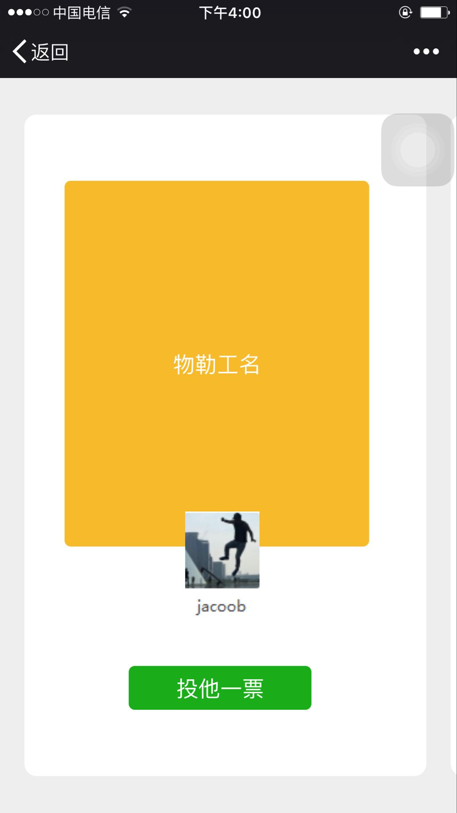

# vote-socket
## 一个小的投票策程序，后端通过nodejs的socket接收数据

## 特色

* 需要安装socket模块 ws，地址:https://github.com/websockets/ws
* 使用swiper实现滑动效果

---------------

### 新增

提供一个使用ajax轮训处理方案，模拟websocket，参考文件test.html及vote.php。

体验地址：http://www.loadphp.cn/h5/vote/test.html  (最好在手机上查看)

----------

### 视觉，左右滑动（仿微信读书）

 